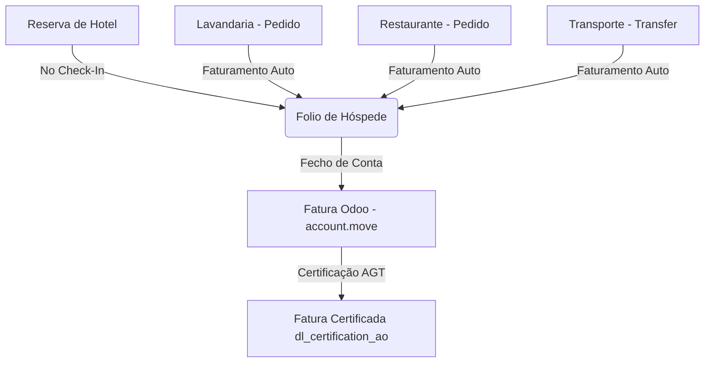
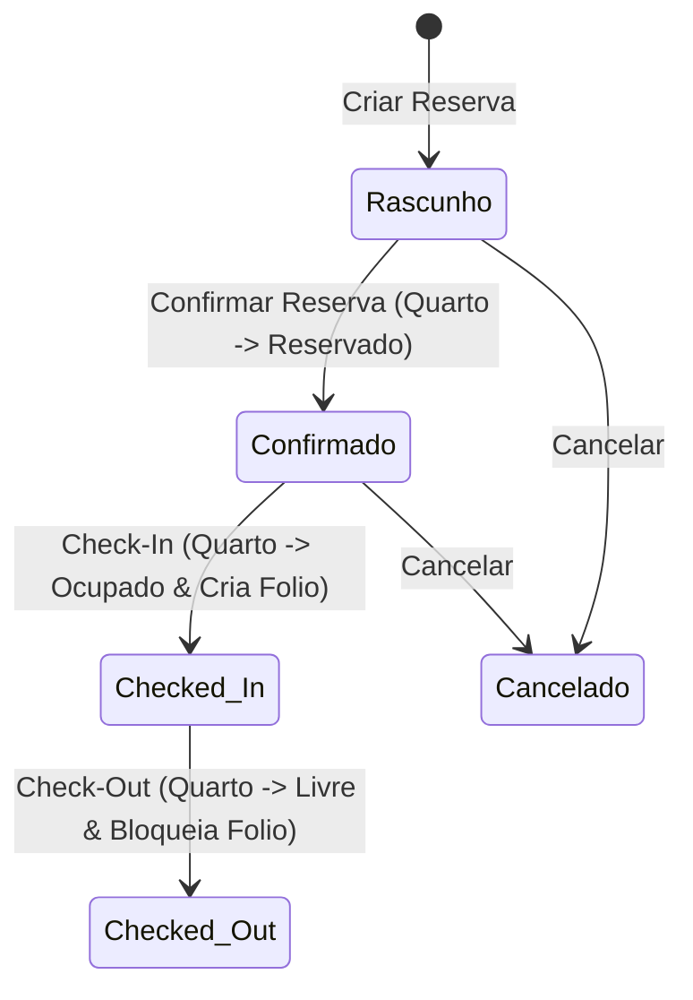

# Manual de Utilização Completo - Digitalub Gestão Hoteleira (Odoo 17)

Este manual descreve detalhadamente o funcionamento, parametrização e utilização operacional do módulo **Digitalub - Gestão Hoteleira Completa** para o Odoo 17. O módulo foi desenvolvido especificamente para automatizar a operação de hotéis, pensões e alojamentos locais, integrando todos os consumos de hóspedes num único documento de fecho de conta (**Folio**) e gerando faturas em conformidade com as exigências da AGT (Administração Geral Tributária) em Angola através do módulo de faturação certificada **`dl_certification_ao`**.

---

## 1. Visão Geral do Sistema e Arquitetura de Dados

O módulo foi estruturado sobre os seguintes pilares operacionais:
*   **Gestão de Infraestrutura (Quartos):** Organização física do hotel por Andares, Categorias de Quartos (Tipos) e Quartos físicos.
*   **Ciclo de Vida da Reserva:** Gestão integrada de estados de reservas (desde o rascunho até à saída/check-out).
*   **Serviços de Hóspedes (Extras):** Módulos independentes para lançar gastos de Lavandaria, Restaurante/Serviço de Quarto e Transporte (Transfers) diretamente associados à reserva do hóspede.
*   **Folio Consolidado:** Uma conta-corrente temporária do hóspede que acumula automaticamente o alojamento e todos os consumos extras em tempo real.
*   **Faturação Certificada AGT:** Processo integrado para converter o Folio numa fatura nativa do Odoo (`account.move`) que é posteriormente assinada digitalmente com as normas de Angola.

### Fluxo de Dados e Integração

---

## 2. Configurações Iniciais e Cadastro de Infraestrutura

Antes de iniciar as operações, é obrigatório parametrizar a estrutura do hotel. Aceda ao menu **Hotel > Configuração**.

### 2.1. Andares (Floors)
Os andares são utilizados para agrupar e organizar os quartos visualmente no painel Kanban.
1. Aceda a **Hotel > Configuração > Andares** e clique em **Novo**.
2. Defina o **Nome do Andar** (Ex: *R/C*, *1º Andar*, *Bloco Executivo*).
3. Defina a **Sequência** (números menores fazem com que o andar apareça primeiro no painel Kanban).
4. Selecione a **Empresa/Hotel** associada (essencial para ambientes multi-hotel).
5. Clique em **Guardar**.

### 2.2. Tipos de Quarto (Room Types)
Representa as categorias comerciais dos quartos e os seus respetivos preços unitários de referência.
1. Aceda a **Hotel > Configuração > Tipos de Quarto** e clique em **Novo**.
2. Insira o nome do **Tipo** (Ex: *Standard Single*, *Suíte Deluxe*, *Apartamento T2*).
3. Insira o **Preço Base por Noite** (este preço será sugerido por padrão em todas as novas reservas deste tipo).
4. Adicione uma **Descrição** detalhada com o inventário padrão ou características especiais.
5. Clique em **Guardar**.

### 2.3. Quartos (Rooms)
Representação física de cada unidade de alojamento.
1. Aceda a **Hotel > Quartos** e clique em **Novo**.
2. Indique o **Número/Nome do Quarto** (Ex: *Quarto 101*, *Suíte N'gola*).
3. Selecione o **Andar** e o **Tipo de Quarto**.
4. Defina a **Capacidade Máxima** de pessoas permitidas.
5. Indique as **Comodidades** disponíveis, selecionando as caixas correspondentes (Wi-Fi, Minibar, Jacuzzi, Varanda).
6. O estado inicial é definido automaticamente como **Livre** (Vacant).
7. Clique em **Guardar**.

> [!TIP]
> **Painel de Controlo Kanban (Quartos):** 
> Ao aceder ao menu **Hotel > Quartos**, verá um painel Kanban interativo dividido por Andares. As cores dos quartos representam o estado atual em tempo real:
> *   🟩 **Livre (Vacant):** Quarto limpo e disponível para novas entradas.
> *   🟧 **Reservado (Reserved):** O quarto tem uma reserva confirmada para iniciar no próprio dia.
> *   🟥 **Ocupado (Occupied):** O hóspede efetuou o Check-In e está no quarto.

---

## 3. Gestão Completa de Reservas (`hotel.booking`)

A Reserva centraliza as datas de estadia do hóspede principal, os seus acompanhantes, preços combinados e o estado da reserva.

### 3.1. Criar uma Nova Reserva
1. Aceda ao menu **Hotel > Reservas > Lista de Reservas** e clique em **Novo**.
2. Selecione o **Hóspede Principal** no campo *Nome do Hóspede Principal* (isto abre a listagem padrão de Clientes do Odoo). O sistema preenche automaticamente o *Telefone* e o *Email* do cliente.
3. Defina as datas nos campos **Data de Check-In** e **Data de Check-Out**.
4. Indique a quantidade de **Adultos** e **Crianças**.
5. No separador **Quartos na Reserva**, clique em *Adicionar uma Linha*:
    *   Selecione o **Quarto** disponível.
    *   O sistema preenche automaticamente o *Tipo de Quarto* e a *Taxa/Noite* (Preço Base).
    *   O preço sugerido pode ser alterado manualmente para esta reserva específica.
    *   O sistema calcula automaticamente o número de **Noites** e o **Subtotal** (Noites × Taxa/Noite).
6. No separador **Hóspedes Registrados**, lance a listagem de todas as pessoas que vão partilhar o quarto com o hóspede principal.
    *   Insira o **Nome do Hóspede**.
    *   Selecione o **Quarto Alocado** (caso a reserva inclua múltiplos quartos).
    *   Indique o **Tipo de Documento** (*Passaporte*, *Bilhete de Identidade / RG*, *Carta de Condução*).
    *   Insira o **Nº do Documento**. (Estes dados são críticos para relatórios legais e segurança do hotel).
7. Clique em **Guardar**.

### 3.2. Regras de Segurança Automáticas (Validações no Gravar)
O sistema possui duas validações ativas de segurança em nível de base de dados:
*   **Consistência de Datas:** Não é permitido gravar se a data de Check-Out for anterior ou igual à data de Check-In. Caso ocorra, o Odoo exibirá uma mensagem de erro: *"A data de Check-Out deve ser posterior à data de Check-In."*
*   **Prevenção de Dupla Reserva (Double-Booking):** Se tentar gravar uma reserva em estado "Confirmado" ou "Checked In" para um quarto que já possui outra reserva confirmada ou ativa sobreposta no mesmo intervalo de datas, a gravação será bloqueada com a mensagem: *"O quarto X já está reservado ou ocupado no período selecionado..."*

---

## 4. Ciclo de Vida da Reserva e Estados do Quarto

O fluxo operacional de uma estadia é gerido através de botões inteligentes no cabeçalho do formulário da reserva. O status da reserva interage diretamente com o status do quarto físico.

### 4.1. Confirmação (Confirmar)
*   **Ação:** Clique no botão **Confirmar** no canto superior esquerdo da reserva.
*   **Efeito:** O estado da Reserva muda para **Confirmado** (Confirmed). O quarto físico associado muda o seu estado para **Reservado** (Reserved) se a data de entrada for hoje.

### 4.2. Entrada do Hóspede (Check-In)
*   **Ação:** No dia de chegada do hóspede, abra a reserva correspondente e clique no botão **Check-In**.
*   **Efeito:** 
    1. O estado da Reserva passa a **Checked In**.
    2. O estado do Quarto físico muda para **Ocupado** (Occupied).
    3. **Automação:** O sistema gera automaticamente um **Folio** (Conta Corrente) com a referência da reserva, transferindo o valor total contratado de alojamento para a conta-corrente.

### 4.3. Saída do Hóspede (Check-Out)
*   **Ação:** No dia de partida, após a verificação de consumos e pagamento da conta no Folio (ver Secção 6), clique em **Check-Out**.
*   **Efeito:** O estado da Reserva passa a **Checked Out**. O Quarto físico regressa automaticamente ao estado **Livre** (Vacant), ficando disponível para novos hóspedes no painel Kanban.

### 4.4. Cancelamento (Cancelar)
*   **Ação:** Se o hóspede cancelar antes da data de entrada, clique em **Cancelar**.
*   **Efeito:** O estado passa a **Cancelado** (Cancelled) e o quarto é libertado de qualquer bloqueio de data.

---

## 5. Lançamento de Serviços Adicionais (Consumos Extras)

Para faturar serviços adicionais consumidos pelo hóspede durante a estadia sem passar pelo ecrã da receção, utilize as secções dedicadas de serviços.

### 5.1. Pedido de Lavandaria (`hotel.laundry.order`)
1. Aceda a **Hotel > Lavandaria > Pedidos** e clique em **Novo**.
2. Selecione o **Quarto** do hóspede. 
3. **Automação:** O sistema pesquisa as reservas ativas no quarto selecionado e preenche automaticamente o campo **Reserva** (somente se a reserva estiver no estado `Checked In`).
4. No separador **Itens**, adicione os consumos:
    *   Insira a descrição do item (Ex: *Camisa de homem*, *Vestido de noite*, *Lavagem a seco de calças*).
    *   Defina a quantidade (**Qtd**) e o **Preço** unitário. O subtotal é calculado de imediato.
5. Faça avançar o estado do pedido conforme a equipa de lavandaria processa a roupa: **Confirmado** ➔ **Recolha** ➔ **Em Processo** ➔ **Entregue**.
6. O valor total do pedido é acumulado e atualiza de imediato o Folio do hóspede.

### 5.2. Pedido de Restaurante (`hotel.restaurant.order`)
1. Aceda a **Hotel > Restaurante > Pedidos** e clique em **Novo**.
2. Selecione o **Quarto** do hóspede. O campo **Reserva** é preenchido de forma automática com a reserva ativa correspondente.
3. No separador **Itens**, adicione a refeição ou bebidas encomendadas (Ex: *Pequeno-almoço Continental*, *Garrafa de Água Mineral 1.5L*, *Prato de Peixe Grelhado*).
4. Insira a quantidade e o preço acordado.
5. Avance o estado do pedido (**Confirmado** ➔ **Em Preparação** ➔ **Entregue**). 
6. O total é imputado em tempo real no Folio do hóspede.

### 5.3. Pedido de Transporte / Transfers (`hotel.transport.request`)
1. Aceda a **Hotel > Transporte > Pedidos** e clique em **Novo**.
2. Selecione a **Reserva** ativa do hóspede. O sistema preenche automaticamente o *Nome do Hóspede*.
3. Selecione o **Tipo** de transfer (*Pickup*, *Drop*, *Ida e Volta*).
4. Defina os campos de rota: **Origem**, **Destino**, **Distância (KM)**, **Veículo** e **Motorista**.
5. No campo **Custo Total**, defina o valor a cobrar ao cliente pelo trajeto.
6. Avance o estado (**Confirmado** ➔ **Em Progresso** ➔ **Concluído**). O valor total é cobrado no Folio correspondente.

---

## 6. O Folio do Hotel e Processo de Faturação Certificada AGT

O **Folio** é a conta corrente que reúne toda a despesa do hóspede durante o período de estadia. É o coração financeiro do módulo.

### 6.1. Visualizar o Folio
1. Aceda a **Hotel > Faturas (Folios)**.
2. Localize e abra o Folio associado à reserva do hóspede.
3. No ecrã principal, poderá consultar:
    *   **Referência:** Identificação única do Folio (Ex: *FOL/BK/0001*).
    *   **Total do Quarto:** O custo acumulado das noites de alojamento.
    *   **Total Geral:** Soma automática de: `Total do Alojamento` + `Total de Lavandaria` + `Total de Restaurante` + `Total de Transportes`.
4. Os separadores inferiores organizam as despesas por categoria:
    *   **Serviços de Lavanderia:** Lista todos os pedidos lançados no módulo de lavandaria com referências e montantes.
    *   **Consumos de Restaurante:** Lista todas as refeições debitadas ao quarto.
    *   **Serviço de Transporte:** Lista todos os transfers agendados.

### 6.2. Fechar Conta e Emitir Fatura Certificada AGT
No dia de saída do hóspede (Check-Out), siga este processo exato para emitir a Fatura Legal em conformidade com as regras do mercado angolano:

1. No formulário do Folio, clique no botão **Emitir Fatura Certificada** no canto superior esquerdo.
2. **Automações Internas de Backend:**
    *   O sistema valida se o Folio já tem uma fatura ativa (para evitar duplicidade).
    *   Gera um registo de Fatura de Cliente nativo do Odoo (**`account.move`**).
    *   Cria linhas de fatura distintas e detalhadas para:
        *   *Alojamento* (referenciando o número da reserva e número de noites).
        *   Cada pedido de *Lavandaria* consolidado.
        *   Cada consumo de *Restaurante* detalhado.
        *   Cada serviço de *Transporte* individualizado.
    *   Muda o estado do Folio de *Aberto* para **Fechado**.
3. **Redirecionamento:** O Odoo redireciona automaticamente o ecrã do utilizador para o rascunho da fatura de cliente (`account.move`) recém-criada.
4. **Certificação (Assinatura AGT):**
    *   Reveja a fatura de cliente.
    *   Clique no botão **Confirmar** (ou Validar) no cabeçalho da fatura.
    *   Nesse instante, o módulo **`dl_certification_ao`** interceta a validação, comunica internamente os dados, aplica o algoritmo de assinatura do governo de Angola (AGT) e anexa as chaves de assinatura e o código **Hash** correspondente à fatura.
    *   O documento passa para o estado "Lançado" (Posted) e está legalmente certificado para impressão física ou envio em formato PDF por correio eletrónico.
5. **Acesso Futuro (Smart Button):** No Folio fechado, ficará ativo um botão inteligente no canto superior direito chamado **Fatura Odoo**. Ao clicar nele, a receção pode consultar o documento fiscal certificado a qualquer altura.

> [!IMPORTANT]
> **Faturação Certificada de Consumos Separados:**
> Se o hóspede precisar de faturas separadas (Ex: uma fatura para a empresa referente ao alojamento e outra para consumo próprio referente a restaurante e lavandaria), a equipa financeira pode ajustar as linhas no rascunho da fatura nativa antes de clicar em "Confirmar", ou reabrir o Folio para faturar separadamente.

---

## 7. Operações em Ambiente Multi-Hotel (Multi-Empresa)

Caso a organização opere mais de uma unidade de hotel na mesma base de dados (Ex: *Hotel Luanda*, *Hotel Benguela*):

*   **Seleção de Empresa:** O utilizador deve certificar-se de que selecionou o hotel correto no seletor de empresas do Odoo no canto superior direito.
*   **Campos de Controlo:** Os formulários de Andares, Quartos, Tipos de Quartos, Reservas, Serviços e Folios possuem o campo **Hotel/Empresa** oculto ou visível, preenchido automaticamente com a empresa ativa no momento da criação.
*   **Regras de Acesso e Isolamento (Record Rules):** 
    O sistema inclui regras de registo de segurança ativas no ficheiro `security/hotel_security.xml`. Os utilizadores de uma unidade hoteleira não conseguem ver, alterar ou faturar quartos ou estadias pertencentes a outra empresa. O painel Kanban de quartos só exibe a estrutura física da empresa ativa selecionada.

---

## 8. Automatizações em Segundo Plano e Manutenção do Sistema

### 8.1. Sincronização de Estado de Quartos (Ação Agendada / Cron)
Para evitar falhas humanas onde quartos continuem marcados como ocupados após a data de checkout, ou livres mesmo com reservas válidas:
*   O sistema conta com um serviço agendado interno chamado **"Hotel: Atualizar Status de Quartos Diário"** (`ir.cron`).
*   Este processo é executado automaticamente todos os dias às 00:00.
*   **Lógica de Execução:** Percorre todos os quartos e verifica se existem reservas em estado *Checked In* ou *Confirmado* ativas para a data de hoje. Atualiza os quartos em lote para **Ocupado**, **Reservado** ou **Livre** (Vacant), mantendo o Kanban do dia seguinte perfeitamente atualizado.
*   *Execução Manual:* Um administrador pode forçar a execução deste processo em **Definições > Técnico > Ações Agendadas > Hotel: Atualizar Status de Quartos Diário** clicando no botão **Executar Manualmente**.

---

## 9. Guia de Resolução de Problemas (FAQ & Troubleshooting)

### 9.1. O ícone do módulo de hotel aparece em branco/desconfigurado nas aplicações
**Causa:** O ícone do módulo foi atualizado ou alterado recentemente e a cache do navegador web do utilizador ou do servidor Odoo ainda contém o ficheiro antigo.
**Resolução:**
1. Aceda à pasta do módulo e verifique se a imagem está guardada em: `/static/description/icon.png` (formato PNG, recomendado tamanho de 128x128 píxeis).
2. No Odoo, aceda a **Aplicações**, retire o filtro de aplicações da barra de pesquisa, procure pelo módulo e clique em **Atualizar**.
3. No seu navegador web (Google Chrome, Firefox, Edge), efetue uma limpeza de cache forçada pressionando as teclas **Ctrl + F5** (ou **Cmd + Shift + R** em macOS).

### 9.2. Erro de Javascript (Owl) ao abrir o menu de Definições Gerais
**Mensagem típica:** `OwlError: Cause: Error: "res.config.settings"."sale_header_name" field is undefined.`
**Causa:** Isto ocorre quando existe um módulo de personalização de layouts (Ex: `dl_layouts_ao`) que tenta adicionar ou referenciar um campo nas Definições Gerais que não está declarado no ficheiro Python de configurações do Odoo. Como as Definições Gerais englobam todos os menus, o erro bloqueia o ecrã completo impedindo a ativação do modo de programador.
**Resolução:**
1. Contorne a vista padrão abrindo diretamente a listagem de vistas do Odoo inserindo o seguinte link no seu navegador após o endereço do servidor: 
   `http://[IP_DO_SERVIDOR]:8069/web#model=ir.ui.view&view_type=list`
2. No campo de pesquisa superior, procure pela palavra `sale_header_name`.
3. Localize a vista de configurações herdada que tenta renderizar este campo (frequentemente associada ao módulo de faturação ou layouts localizados).
4. Desative temporariamente a vista (clique no registo, desmarque o campo "Ativo") ou edite a arquitetura da vista para remover a linha que contém `<field name="sale_header_name"/>`, guarde e atualize as aplicações.

### 9.3. Avisos de fecho inesperado de WebSocket no log do servidor
**Mensagem típica:** `WARNING: Exception in _kick_all - websocket.py`
**Causa:** O Odoo 17 utiliza conexões persistentes WebSocket (Longpolling) para notificações internas no chatter e chat. Ao reiniciar o servidor local, o processo tenta desligar de forma forçada as threads de comunicação ativas dos utilizadores ligados, gerando este aviso.
**Impacto:** Nenhum. Pode ser totalmente ignorado, pois trata-se apenas de um comportamento normal do servidor Odoo durante a paragem do serviço.
